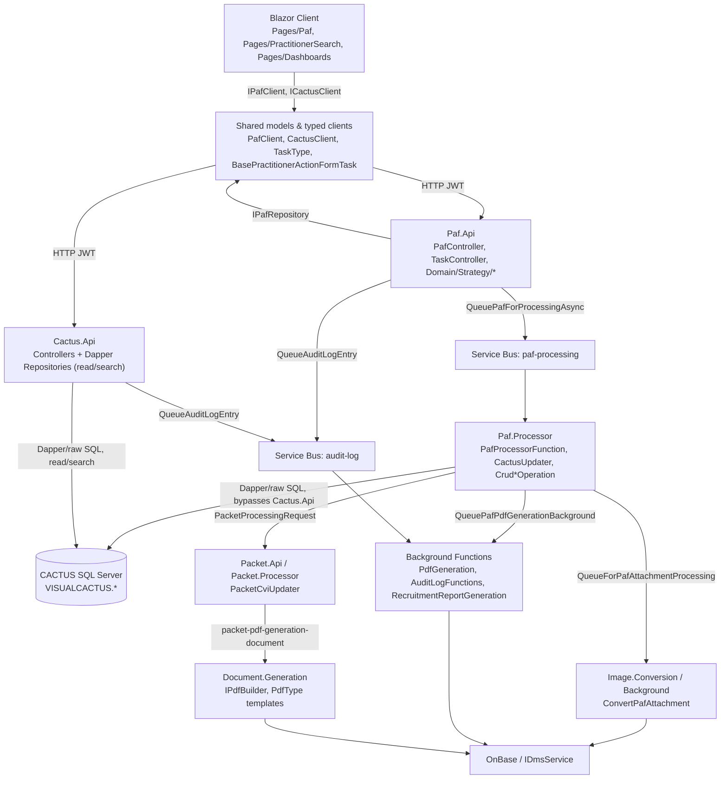

# ADD NPP — Code-Level Architecture (Repository Evidence)

> **Status:** Read-only architecture discovery. No application code was modified to produce this document.
> **Scope:** Verified mapping between the existing HCP/Credentialing-2.0 repository implementation and the capabilities ADD NPP will reuse or extend.
> **Rule applied throughout:** Every path/class/method below was observed directly in the repository. Anything not confirmed is explicitly marked **Repository Evidence Gap**. Nothing in this document is invented.
> **This document is NOT an ADD NPP implementation plan.** It does not propose new classes, services, or components. It is a verified map of the CURRENT repository only.

---

## 0. How This Document Was Produced

Discovery was performed directly against the actual source in this workspace:

- `Hca.Credentialing/Hca.Credentialing/Client` — Blazor WASM UI
- `Hca.Credentialing/Hca.Credentialing/Shared` — shared models, validation, typed HTTP clients
- `Hca.Credentialing/Hca.Credentialing/Server` — IDP host, audit/admin controllers
- `Hca.Credentialing/Hca.Credentialing.Paf.Api` — PAF REST API + Strategy pattern
- `Hca.Credentialing/Hca.Credentialing.Paf.Processor` — PAF → CACTUS async processor
- `Hca.Credentialing/Hca.Credentialing.Packet.Api` / `Hca.Credentialing.Packet.Processor` — privilege packet lifecycle, CVI updates
- `Hca.Credentialing/Hca.Credentialing.Cactus.Api` — CACTUS REST API (Dapper over SQL Server)
- `Hca.Credentialing/Hca.Credentialing.Background` — Azure Functions (PDF, audit log, notifications, reporting)
- `Hca.Credentialing/Hca.Credentialing.Image.Conversion` / `Hca.Credentialing.Document.Generation` — attachment conversion, PDF templates
- `*.Tests` projects for each of the above

All findings are classified per the skill's evidence taxonomy: **Repository Evidence** (this document is composed entirely of this class, plus **Inference** only where explicitly labeled).

---

## 1. Begin PAF (Existing) — Entry Point Discovery

| Item | Repository Evidence |
|---|---|
| MSP Dashboard | `Client/Pages/Dashboards/MspDashboardPage.razor` — component `MspDashboardPage`, routes `@page "/Msp/Dashboard/{NavigateTab?}/{QueueType?}"` and `@page "/Psg/Dashboard/{NavigateTab?}/{QueueType?}"`. Renders `<SharedPafQueue>` / `<SharedPacketQueue>` tabs. `@attribute [Authorize(Roles = "Msp, Psg")]`. |
| "Begin PAF" button | Not on `MspDashboardPage` itself — lives inside `Client/Pages/Queues/Components/PafQueueSearchCriteria.razor` (text "Begin PAF" / "Begin Request" for recruitment users), gated by a `CanBeginPaf` bool parameter, wired to a `<Button OnClick="@NavigateToStartPaf">`. |
| Begin PAF action | `PafQueueSearchCriteria.razor.cs` → `NavigateToStartPaf()` calls `NavigationManager.NavigateTo(PageUri.PractitionerSearchUri)` (constant defined in `Client/Pages/Shared/PageUri.cs`, value `/Practitioner/Search`). No state is cleared at this step. |
| Workflow-state initialization | Happens once a practitioner is chosen: `Client/Pages/PractitionerSearch/Components/PractitionerSearchTable.razor.cs` → `StartPafFrom(PractitionerSummary, string)` sets `StateContainer.PafStartingState.PractitionerSummary` / `PractitionerEmailOverride`, then calls `Navigation.NavigateToNewPaf(returnUri)` (`Client/Pages/Shared/NavigationManagerExtensions.cs`, navigates to `PageUri.NewPafUri` = `/Paf/New`). |
| PAF creation landing page | `Client/Pages/Paf/PractitionerPafPage.razor.cs`, routes `@page "/Paf/{PafId}/{Mode}"` / `@page "/Paf/New"`. In `OnParametersSetAsync()`, when `PafId` is empty it reads `StateContainer.PafStartingState.PractitionerSummary`, builds a `CreatePafRequest` (`Type = ManageNewPractitioner` or `ManageExistingPractitioner`), and calls `IPafClient.CreateNewPafAsync(pafRequest)`. |
| Authorization | `MspDashboardPage.razor`: `[Authorize(Roles = "Msp, Psg")]`. `PractitionerSearchPage.razor`: `[Authorize(Roles = "Msp, Psg, Recruiter, RecruiterManager")]`. **Repository Evidence Gap:** no separate policy/attribute scoped specifically to the Begin PAF button — visibility is controlled only by the `CanBeginPaf` parameter; its upstream source (likely `SharedPafQueue.razor.cs`) was not traced further. |
| Tests | No Blazor client test project exists in the repository. No test coverage found for `MspDashboardPage`, `PafQueueSearchCriteria`, or the Begin PAF navigation chain. |

---

## 2. Enforce NPI Search (Existing) — Discovery

| Item | Repository Evidence |
|---|---|
| Search form | `Client/Pages/PractitionerSearch/Components/PractitionerSearchForm.razor.cs` — class `PractitionerSearchForm`. `OnNpiFieldChanged()` calls `ValidationRoutines.DoNpiValidation(...)`. Has `SearchMode.NpiSearch` / `SearchMode.ExceptionSearch` (`SwitchToNpiSearch` / `SwitchToExceptionSearch`) — this **is** the existing "controlled no-NPI exception" toggle referenced by NPP requirements. |
| NPI validation | `ValidationRoutines.DoNpiValidation(string value, bool required)` in `Shared/Validations/ValidationRoutines.cs` (10-digit, must start with 1 or 2); also enforced via data-annotation `NpiAttribute` in `Shared/Validations/Npi.cs`. |
| Search execution | `Client/Pages/PractitionerSearch/Components/PractitionerSearchTable.razor.cs` — `LoadPractitionersAsync()` calls `ICactusClient.Practitioners.SearchExistingPractitionersAsync(_searchParameters)`. |
| Duplicate detection | `Shared/Helpers/PractitionerDuplicateCheckHelper.cs` — `FindDuplicates(emailAddress, ssn, npi, duplicateOfPractitonerId)` and `FindDuplicatesForRecruitment(practitioner, duplicateOfPractitonerId)`, both call `ICactusClient.Practitioners.SearchExistingPractitionersAsync` (`Match`/`Recruitment` mode) plus `ICactusClient.Delegates.SearchExistingDelegatesAsync`, return `DuplicateMatchResult`. |
| Post-search navigation | Selecting a row calls `ShowExistingPractitionerPafModal(PractitionerSummary)`, which sets `_targetPractitioner` and opens `Client/Pages/PractitionerSearch/Components/ConfirmationWizard/ConfirmationWizardModal.razor.cs`; on completion it raises `OnNewPractitionerModalComplete` → `StartPafFrom(...)` (§1). |
| Tests | **Repository Evidence Gap** — no test found for `PractitionerSearchForm`, `ValidationRoutines.DoNpiValidation`, `NpiAttribute`, `PractitionerSearchTable`, or `PractitionerDuplicateCheckHelper`. |

**ADD NPP reuse determination:** This is the mechanism named in tickets 53658 / 127104 as "Enforce NPI Search" / "existing Add New Practitioner search" to be reused. The NPI-required/no-NPI-exception toggle (`SearchMode`) already exists exactly as described in requirements.

---

## 3. Add New Practitioner (Existing) — Discovery

| Item | Repository Evidence |
|---|---|
| UI form | `Client/Pages/PractitionerSearch/Components/ConfirmationWizard/AddNewPractitionerForm.razor.cs` — data model `NewPractitionerModel`; `GetFormAsPractitioner()` maps the form to a `PractitionerSummary`. |
| Orchestration/submit | `ConfirmationWizardModal.razor.cs` → `SaveNewPractitionerAsync()`: validates form → `SwitchToDuplicateModeIfNecessary()` (uses `PractitionerDuplicateCheckHelper`) → checks `IIdpClient.UserAccountExistsAsync(email)` → raises `OnComplete` with `CloseStatus.New` and the built `PractitionerSummary`. |
| Handoff to PAF creation | `PractitionerSearchTable.OnNewPractitionerModalComplete` sets `e.Practitioner.IsNew = true` and calls `StartPafFrom(...)` → ultimately `IPafClient.CreateNewPafAsync(CreatePafRequest)` in `PractitionerPafPage` (§1). There is **no direct API call from the Add New Practitioner form itself** — it only builds the `PractitionerSummary` that flows through `StateContainer.PafStartingState` into `CreatePafRequest.ExistingOrNewPractitioner`. |
| Data model | `Practitioner.cs` (`Shared/Data/Model/Practitioner/Practitioner.cs`) has the `IsNew` flag that downstream code (demographics, licenses, CACTUS operations) branches on for new-vs-existing behavior. |
| Tests | **Repository Evidence Gap** — none found for `AddNewPractitionerForm` or `ConfirmationWizardModal`. |

---

## 4. Existing Add Practitioner to Facility Code Flow (Required Section)

This is the primary reference pattern for ADD NPP.

```text
UI
  Client/Pages/Paf/PractitionerPafPage.razor.cs
    → OnParametersSetAsync() builds CreatePafRequest, calls IPafClient.CreateNewPafAsync(...)
  Client/Pages/Paf/Components/Tasks/AddPractitionerToFacilities/AddPractitionerToFacilitiesTask.razor.cs
    → task-card UI: per-facility corporate/facility questions (_facilityQuestionValues)
    → reads StateContainer.PafState.AddPractitionerToFacilitiesTask
    → ValidateAndSave()
  Client/Pages/Paf/Components/FacilityDisplay.razor.cs
    → displays StateContainer.PafState.SelectedFacilities
↓
State/Model (Shared.Data.Model.Paf.Form / Shared.Data.Model.Paf)
  PractitionerActionFormData — root PAF form model (SelectedFacilities, TaskSelected, AddPractitionerToFacilitiesTask)
  AddPractitionerToFacilitiesTask — FacilityQuestions (FacilityQuestionValues[]), CorporateQuestions, IsRequired
  CreatePafRequest — Type, ExistingOrNewPractitioner, IsRecruitmentPaf
  PafProcessingResult — wraps PafFormData returned by every strategy execution
↓
Client Service
  Shared/Clients/Paf/PafClient.cs (IPafClient)
    → CreateNewPafAsync(CreatePafRequest)        POST api/Paf/CreateNewPaf
    → AddTaskToPafAsync(TaskType, formData)      PUT  api/Paf/AddTaskToPaf?task=...
    → UpdateTaskAndSavePafAsync(...)             PUT  api/Paf/UpdateTaskAndSavePaf?task=...
    → SubmitPafAsync(formData)                   PUT  api/Paf/SubmitPaf
↓
API / Controller
  Hca.Credentialing.Paf.Api/Controllers/PafController.cs
    → CreateNewPafAsync    → CreateStartNewPafStrategy(...)
    → AddTaskToPafAsync    → CreateAddTaskStrategy(TaskType.AddPractitionerToFacility)
    → UpdateTaskAndSavePafAsync → CreateUpdateTaskStrategy(task, runValidation)
    → SubmitPafAsync       → CreateSubmitPafStrategy()
↓
Business Logic (Strategy pattern)
  Hca.Credentialing.Paf.Api/Domain/Strategy/PafProcessingStrategyContext.cs
    → factory: TaskType.AddPractitionerToFacility => new AddTaskAddPractitionerToFacilityStrategy(this)
  Hca.Credentialing.Paf.Api/Domain/Strategy/AddTaskAddPractitionerToFacilityStrategy.cs
    → InternalExecuteAsync(): builds FacilityQuestions from FormData.SelectedFacilities,
      initializes SpecialtyTask, conditionally PerfTask
  Hca.Credentialing.Paf.Api/Domain/Strategy/SubmitPafStrategy.cs
    → InternalExecuteAsync(): routes by role (MSP/CPC/Recruitment)
    → ProcessSubmitForMspAsync/CpcAsync call UpdateTaskAsync(FormData.AddPractitionerToFacilitiesTask, TaskType.AddPractitionerToFacility, result)
    → sets status (SubmittedByMsp/ResubmittedByMsp)
    → OnAfterExecuteAsync() calls _pafProcessingService.QueuePafForProcessingAsync(FormData.FormId)
↓
Data Access
  Hca.Credentialing.Paf.Api/Data/Repositories/PafRepository.cs (IPafRepository)
    → UpdatePafAsync(PractitionerActionForm paf, ...) persists PAF (incl. SelectedFacilities /
      IndexedPafSelectedFacilities) to SQL table PractitionerActionForm
↓
Queue / Processor
  IPafProcessingService.QueuePafForProcessingAsync → Service Bus queue "paf-processing"
    (message type PafProcessingRequest)
  Hca.Credentialing.Paf.Processor/PafProcessorFunction.cs
    → [Function("PafProcessorFunction")], [ServiceBusTrigger("paf-processing", Connection="HcoServiceBus")]
    → deserializes PafProcessingRequest, calls new CactusUpdater(...).UpdateCactusFromPafAsync(...)
  Hca.Credentialing.Paf.Processor/Cactus/CactusUpdater.cs
    → UpdateCactusFromPafAsync: opens SqlConnection + transaction to CACTUS DB,
      sets up CactusAuditContext/CactusUnitOfWork, calls UpdateFromNewAsync or
      UpdateFromExistingAsync depending on paf.Practitioner.IsNew
↓
CACTUS (direct SQL, not via Cactus.Api HTTP)
  Hca.Credentialing.Paf.Processor/Cactus/Operations/CrudCredentialingAssignmentOperation.cs
    → SaveCredentialingAssignmentAsync(): raw SQL INSERT INTO VISUALCACTUS.CREDENTIALINGASSIGNMENTS,
      then CactusAuditContext.BeginSessionAsync(key, "CREDENTIALINGASSIGNMENTS")
      (special-cased logic for taskSelected == TaskType.AddPractitionerToFacility)
  Hca.Credentialing.Paf.Processor/Cactus/Operations/CrudEntityAssignmentOperation.cs
  Hca.Credentialing.Paf.Processor/Cactus/Operations/CrudEntityCredentialingOperation.cs
    → both branch on PafDataContext.Paf.TaskSelected == TaskType.AddPractitionerToFacility
      to create facility/entity assignment rows tying practitioner to selected facility
  Hca.Credentialing.Paf.Processor/Cactus/Operations/CrudEntityCredentialingGroupOperation.cs
  Hca.Credentialing.Paf.Processor/Cactus/Operations/CrudPractitionerLicensesOperation.cs
    → also branch on this task type (IsAddPractitionerToFacility flag)
  NOTE: Hca.Credentialing.Cactus.Api's PractitionerFacilityController (SearchPractitionerFacilitiesAsync)
        is READ/SEARCH ONLY. The write path bypasses the Cactus.Api HTTP layer entirely and goes
        directly from Paf.Processor to the CACTUS SQL Server database via Dapper/raw SQL.
↓
Documents / History / Audit
  CactusUpdater (success path) → pafDataContext.DequeuePafPdfsForProcessing()
    → _serviceBusService.QueuePafPdfGenerationBackground(PafPdfGenerationBackgroundRequest)
  Hca.Credentialing.Background/Functions/PdfGeneration.cs
    → [Function("GeneratePdfFromCompletedPaf")], [ServiceBusTrigger("paf-pdf-generation-background")]
    → generates PDF blob, stores in OnBase
  CactusUpdater.CreatePafHistoryAsync(PractitionerActionFormHistory, ...) writes PAF history
    records at each processing milestone (e.g. "Cactus updates complete.")
  CACTUS-side field audit: CactusAuditContext/CactusUnitOfWork (CactusAuditLog library) —
    BeginSessionAsync/PostUpdateAsync/CommitAuditsAsync per changed CACTUS entity
  Application-level audit: Hca.Credentialing.Background/Functions/AuditLogFunctions.cs
    → [Function("CreateAuditLogEntry")], [ServiceBusTrigger("audit-log")]
    → IAuditLogRepository.CreateAuditLogEntryAsync(AuditLog)
```

**Repository Evidence Gaps in this flow:**
- The exact button/markup that begins "Add Practitioner to Facility" specifically (as distinct from the generic Begin PAF button) was not located as literal text in `MspDashboardPage.razor.cs`; it may be in a `.razor` markup file not textually searched, or task selection may happen via `PafTaskSelection.razor` (see §5) rather than a dedicated dashboard button.
- The exact publisher of the `audit-log` Service Bus message specific to the Add-Practitioner-to-Facility action was not traced to a specific call site.
- No test was confirmed by name to explicitly target `TaskType.AddPractitionerToFacility` (searched `CactusUpdaterIntegrationTests.cs`, `CactusOperationIntegrationTests.cs`, `CactusApiIntegrationTests.cs` for the literal string "AddPractitionerToFacility" — no match). Coverage may exist indirectly through broader PAF-processing integration test fixtures (see §12 Test Map).

---

## 5. PAF Creation & PAF Tasks Architecture

### 5.1 PAF Creation / PAF Type / Initialization

- `CreatePafRequest` (`Shared/Data/Model/Paf`) — `Type` (`ManageNewPractitioner` / `ManageExistingPractitioner`), `ExistingOrNewPractitioner`, `IsRecruitmentPaf`.
- `PafController.CreateNewPafAsync` → `PafProcessingStrategyContext.CreateStartNewPafStrategy(...)`.
- Practitioner/facility association is captured on `PractitionerActionFormData.SelectedFacilities` and persisted via `IPafRepository.UpdatePafAsync` (flattened into `Indexed*` columns for querying, e.g. `IndexedPafStatus`, `IndexedTaskSelected`, `IndexedPafSelectedFacilities`).

### 5.2 PAF Task Model

| Item | Repository Evidence |
|---|---|
| Task type enum | `TaskType` — `Shared/Data/Model/Paf/TaskType.cs` (`ManagePersonalInfo`, `AddPractitionerToFacility`, `ManageAddresses`, `ManageSpecialities`, `OffCyclePsv`, `Recruitment`, `Mss18FacilitySpecificQuestions`, etc.), `[Description]`-decorated for UI labels. |
| Base task class | `BasePractitionerActionFormTask` (abstract) — `Shared/Data/Model/Paf/Form/BasePractitionerActionFormTask.cs`. Properties: `Guid TaskId`, `TaskStatus Status` (`New \| Invalid \| Complete`, `TaskStatus.cs`), `ICollection<string> StatusDetail`, `bool IsRequired`. |
| Concrete tasks | `PractitionerDemographicTask`, `AddressesTask`, `SpecialtyTask`, `CollaboratingPractitionersTask`, `AddPractitionerToFacilitiesTask`, `OffCyclePsvTask`, `OffCycleRrfcTask`, `RecruitmentPsvTask`, `Mss18FacilitySpecificQuestionsTask`, `AddPrivilegesMss18Task`, `RequestProcessingChangeTask`, `ManageDelegateTask`, `PerfTask` — all in `Shared/Data/Model/Paf/Form/`. |
| Lightweight DTO | `TaskDto` (`Name`, `Type`) used only for the initial task-selection list. |

### 5.3 Task Registration / Factory / Strategy

- **Strategy pattern**, not an enum/config table: `Hca.Credentialing.Paf.Api/Domain/Strategy/` has an `AddTaskXStrategy` (initialize on selection) and `UpdateTaskXStrategy` (validate/persist edits) per `TaskType`.
- `PafProcessingStrategyContext.cs` is the factory: `CreateUpdateTaskStrategy(task, runValidation)`, `CreateSubmitPafStrategy()`, `CreateAddTaskStrategy(task)`, called from `PafController`.
- `TaskController.cs` does **not** register tasks — it delegates to `ITaskDeterminationService.GetAvailableTaskListAsync(TaskListParameters)`, which returns the `TaskType`/`TaskDto` list available for a given practitioner/facility/PAF mode (business-rule driven, not a static table). Also exposes `GetAvailableFacilityListAsync`, `GetAvailableServiceLinesAsync`.
- **Repository Evidence Gap:** `ITaskDeterminationService`'s implementation (in `Hca.Credentialing.Paf.Api/Services`) was not opened in this pass — needed for exact per-PAF-type task-availability rules.

### 5.4 Task UI

- `Client/Pages/Paf/PractitionerPafPage.razor.cs` — top-level PAF wizard host (create/edit/lock logic).
- `Client/Pages/Paf/Components/PafTaskSelection.razor.cs` — initial task picker from `_currentAvailableTasks`.
- `Client/Pages/Paf/Components/PafTaskDisplay.razor.cs` — renders a task "card" (icon/title/description) per `TaskType`.
- `Client/Pages/Paf/Components/Tasks/*` — per-task edit forms: `ManagePractitionerInformation/`, `ManageAddresses/`, `ManageSpecialties/`, `ManageDelegate/`, `ManageCollaboratingPractitioners/`, `OffCyclePsv/`, `OffCycleRrfc/`, `RecruitmentPsv/`, `Mss18/`, `Perf/`, `ChangeProcessingType/`, `AddPractitionerToFacilities/`.
- `TaskCompleteEventArgs` (`Client/Pages/Paf/Components/Tasks/TaskCompleteEventArgs.cs`) — event payload (`Result: Save|Convert|Cancel`, `Status`, `StatusDetail`) bubbled when a task edit form finishes.
- `Client/Pages/Paf/Components/ReviewForm/*` — read-only Review & Submit summary cards per task type (`ReviewDemographicTask`, `ReviewAddressesTask`, `ReviewSpecialtiesTask`, etc.), assembled in `PafReviewForm.razor(.cs)`.

### 5.5 Required/Optional Behavior & Review & Submit Gating

- `BasePractitionerActionFormTask.IsRequired` drives per-task display: every `Review*Task.razor` checks `Task?.IsRequired ?? false` (14 occurrences, e.g. `ReviewDemographicTask.razor:27`).
- **The Review & Submit button is NOT gated by a simple "all required complete" flag.** In `PafReviewForm.razor.cs`:
  - `IsSubmittable()` decides "Review & Submit" vs "Review" title based on **PAF lock/status/current user role**, not task completion.
  - The button bound to `OnValidateAndSubmit` ("Validate & Submit") is not conditionally `Disabled=`; validation happens **on click**: it calls `.Save()` on each present `Review*Task` component; if any returns false, submission is aborted with a `NotificationService.Error` (e.g. explicit check for `_recruitmentPsvTask.Status != TaskStatus.Complete`).
  - Server-side, `SubmitPafStrategy` re-validates via `ProcessSubmitForMspAsync`/`CpcAsync`/`RecruitmentAsync`.
- **Repository Evidence Gap:** individual `Review*Task.Save()` required-field bodies were not each read in full.

### 5.6 Task Completion Persistence

- Client: `IPafClient.UpdateTaskAndSavePafAsync(TaskType, bool runValidation, PractitionerActionFormData)` → `PUT api/Paf/UpdateTaskAndSavePaf?task=...&runValidation=...`.
- Server: `PafController.UpdateTaskAndSavePafAsync` → `CreateUpdateTaskStrategy(task, runValidation)` → matching `UpdateTaskXStrategy` sets `task.Status = TaskStatus.Complete` (or `Invalid` with `StatusDetail`).
- Storage: `PractitionerActionForm` (Dapper.Contrib `[Table("PractitionerActionForm")]`) holds the entire `PractitionerActionFormData` (including every task object/status) via `IPafRepository.UpdatePafAsync`, with optimistic locking. **Repository Evidence Gap:** exact serializer/column type for the form-data payload not directly inspected.

### 5.7 Tests

- No dedicated PAF task unit-test project exists (`Hca.Credentialing.Paf.Api.Tests` does not exist in the workspace).
- `Hca.Credentialing.Paf.Processor.Tests` contains `CactusOperationIntegrationTests.cs`, `CactusUpdaterIntegrationTests.cs`, `CrudEntityCredentialingOperationTests.cs` — none target `TaskType`/strategy/task-completion logic by name.
- **Repository Evidence Gap:** no unit/integration tests found for `AddTaskXStrategy`/`UpdateTaskXStrategy`, `TaskController`, `PafTaskSelection`, or `PafReviewForm`.

---

## 6. Practitioner Information / Demographics

| Item | Repository Evidence |
|---|---|
| UI | `Client/Pages/Paf/Components/Tasks/ManagePractitionerInformation/ManagePractitionerInformationTask.razor.cs` — `OnInitializedAsync()` sets role-based required flags (`_dobRequired`, `_genderRequired`, `_ssnRequired`, `_emailRequired`, `_phoneNumberRequired`); `LoadModelFromTask()` sets `_isExistingPractitioner = !practitioner.IsNew` (existing-vs-new read-only trigger); `SaveAsync()` validates, calls `PractitionerDuplicateCheckHelper`, checks `Idp.UserAccountExistsAsync`, raises `OnComplete`. `OnMatchSelected(PractitionerSummary)` handles "convert to existing practitioner." |
| Read-only display | `Client/Pages/Paf/Components/DemographicDisplay.razor.cs` — `LoadData()` renders fields from `PractitionerDemographicTask` when `Practitioner.IsNew`. |
| Model | `Shared/Data/Model/Paf/Form/PractitionerDemographicTask.cs` — `FirstName`, `MiddleName`, `LastName`, `Suffix`, `Degrees`, `Category`, `Gender`, `Dob`, `Ssn`, `Npi`, `Phone`, `Email`, `NoNpi`, `NoNpiReason`, plus `PractitionerDetailNameChangeReason`/`PractitionerDetailNpiChangeReason` enums. |
| Validation | `Shared/Validations/Paf/Form/PractitionerDemographicTaskValidation.cs` exists but is an **empty class body** — actual validation is via data annotations directly on the code-behind `ManagePractitionerInfoModel`. |
| Domain model | `Shared/Data/Model/Practitioner/Practitioner.cs` (has `IsNew`). |
| Save path | No dedicated PAF API endpoint for demographics alone — flows through PAF state and full submission (`PafController` / `PafProcessingService`), then CACTUS mapping via `Hca.Credentialing.Paf.Processor/Cactus/Operations/CrudPractitionerOperation.cs`. |
| CACTUS read | `Hca.Credentialing.Cactus.Api/Controllers/PractitionerController.cs` — `GetPractitionerByIdAsync`, `GetPractitionerByKeyAsync`, `GetPractitionerByThreeFourAsync`. |

---

## 7. Address

| Item | Repository Evidence |
|---|---|
| UI | `Client/Pages/Paf/Components/Tasks/ManageAddresses/ManageAddressesTask.razor.cs` — manages 4 groups: `_homeAddresses`, `_primaryAddresses`, `_credentialingAddresses`, `_alternateAddresses`. `GetConfirmedAddress()` enforces exactly one "Current" address per group. `ValidateAndSaveAddresses()` requires confirmed home/primary/credentialing address, no "Unreviewed" alternates. `SaveAddressesToPaf(bool complete)` raises `OnComplete`. Sub-components: `ManageAddresses.razor.cs`, `ManageAlternateAddresses.razor.cs`, `HomeAddressModal.razor.cs`, `PracticeAddressModal.razor.cs`, `SearchPracticeGroupAddressStep.razor.cs`, `SelectPracticeGroupAddressOptionStep.razor.cs`, `EditPracticeAddressStep.razor.cs`. |
| Model | `Shared/Data/Model/Paf/Form/AddressTask.cs` (`HomeAddresses`, `CredentialingAddresses`, `PrimaryAddresses`, `AlternateAddresses`); `AddressValue.cs` (wraps `Address` + `AddressStatus` enum: `Unreviewed`, `Current`, `NotCurrent`, `NotCurrentRetain` — implements primary-address selection semantics); `Shared/Data/Model/Practitioner/Address.cs` (`IsPracticeGroup`, `GroupKey`/`GroupName` for facility relationship). |
| CACTUS mapping | `Hca.Credentialing.Paf.Processor/Cactus/Operations/CrudPractitionerAddressOperation.cs` — `UpdatePractitionerAddressAsync()` (queries `VISUALCACTUS.PROVIDERADDRESSES`, flips `AddressTypeRtk`, deactivates duplicates), `SavePractitionerAddressAsync()` (inserts new row). Related: `CrudAddressOperation.cs`, `CrudGroupAddressOperation.cs`, `CrudGroupsPractitionersAddressesOperation.cs`. |
| CACTUS read | `PractitionerController.GetPractitionerAddressesAsync`, backed by `IPractitionerAddressRepository`. |

---

## 8. Specialty

| Item | Repository Evidence |
|---|---|
| UI | `Client/Pages/Paf/Components/Tasks/ManageSpecialties/ManageSpecialtiesTask.razor.cs` — `SpecialtyTarget { Primary, Secondary, Alternate }`. `IsDisabled()` enforces fill order and dedupes against `_existingSpecialties`. `IsAlternateAddDisabled()` caps alternates at 20. `SaveSpecialties()` hard-requires Primary specialty (`NotificationService` error otherwise). Modal: `SelectSpecialtyModal.razor.cs`. |
| Model | `Shared/Data/Model/Paf/Form/SpecialtyTask.cs` — `Primary`, `Secondary`, `AlternateSpecialties` (computed from legacy `Tertiary`/`Fourth`/`Fifth`); `Shared/Data/Model/Practitioner/PractitionerSpecialty.cs` (`Key`, `Name`, `Status`, `Type`). |
| CACTUS mapping | `Hca.Credentialing.Cactus.Api/Controllers/PractitionerSpecialtyController.cs` (`GetAllSpecialtiesAsync`, `SearchSpecialtiesAsync`, etc.); `Hca.Credentialing.Paf.Processor/Cactus/Operations/CrudPractitionerSpecialtiesOperation.cs` — diffs vs `VISUALCACTUS.PROVIDERSPECIALTIES`, maps `Primary`/`Secondary`/alternates to `CommonCactusRtks.*ProviderSpecialtyTypeRtk`. |
| PPI | **Repository Evidence Gap** — literal "PPI" not found anywhere in the repository (full-text search, zero matches). Not referenced in code/comments/Specialty task or model files. |

---

## 9. License

| Item | Repository Evidence |
|---|---|
| UI | No standalone "Manage Licenses" PAF task exists (unlike Address/Specialty/Demographic). License UI exists only inside the **Recruitment PSV** flow: `Client/Pages/Paf/Components/Tasks/RecruitmentPsv/RecruitmentStateLicenseVerificationForm.razor.cs` (`ShowStateLicenseModal()` caps at 50, `OnStateLicenseModalComplete()`, `EditStateLicense()`, `RemoveStateLicense()`, `SortLicenses()`); `StateLicenseModal.razor.cs` (`StateLicenseVerificationModel` with `[Required] LicenseState`, `[MaxLength(20)] LicenseNumber`; `Save()`); parent `RecruitmentPsvTask.razor.cs`. |
| Duplicate detection | **Repository Evidence Gap** — no explicit duplicate-license check found beyond the 50-item cap and edit-remove-add replace pattern. |
| Model | `RecruitmentStateLicenseVerificationDetail` (`LicenseState`, `LicenseNumber`); `Shared/Data/Model/Practitioner/PractitionerLicense.cs` — `Key`, `LicenseType`, `LicenseKey`, `StatusKey`, `State`, `AwardedDate`, `ExpirationDate`, `LicenseNumber`, computed `IsExpired`/`IsAboutToExpire` (< 45 days) — this is the license status logic. |
| CACTUS integration | `Hca.Credentialing.Cactus.Api/Controllers/LicenseController.cs` (life-support licenses/boards), `PractitionerLicenseController.cs` (`SearchExpiredLicensesAsync`, `SearchUnverifiedInstitutionsAsync`, `SearchUnverifiedPractitionersAsync`, `SearchVerifiedAsync`); data layer `PractitionerLicenseRepository.cs`, `PractitionerExpiredLicenseQueryBuilder.cs`, `LicenseRepository.cs`. |
| Persistence | `Hca.Credentialing.Paf.Processor/Cactus/Operations/CrudPractitionerLicensesOperation.cs` — derives DEA/CDS requirements per facility state, tracks `deaStatesAdded`/`cdsStatesAdded` HashSets to avoid duplicate state licenses, `LoadActiveLicenseRecordsAsync`, `InsertLicenseAsync`, `UpdateLicenseAsync`; also inserts a hardcoded default license checklist (AAR, CME, background check). Variant: `CrudPerfPractitionerLicensesOperation.cs`. |

---

## 10. PSV / Documents

| Item | Repository Evidence |
|---|---|
| Upload UI | `Client/Pages/Paf/Components/PafFile.razor(.cs)` — reusable upload component; `BeforeUpload(UploadFileItem file)` validates extension (`AcceptedExtensions`) and size (20MB cap, `_showFileUploadSizeErrorMessage`/`_showInvalidFileErrorMessage`). Consumers: `OffCyclePsvLoa.razor.cs` (`HandleAfterUpload`/`HandleAfterRemove`), model `OffCyclePsvTask.cs`. |
| PSV type models | `Shared/Data/Model/Paf/Form/RecruitmentPsvTask.cs` — `RecruitmentNpiPsvTypeDetail` (NPI PSV), `RecruitmentOigEplsPsvTypeDetail` (Sanctions/OIG-EPLS PSV), `RecruitmentStateLicenseVerificationDetail` (License PSV), `RecruitmentCvFileAttachmentDetail`. |
| Server upload | `PafController.UploadPafAttachmentAsync` — `[RequestSizeLimit(20971520)]`, whitelists `.pdf,.doc,.docx,.jpg,.jpeg,.tif,.tiff,.bmp,.png`; malware scan via `containerClient.UploadAndScanAsync(...)` (throws if `MalwareScanResult.Infected`); persists via `IPafRepository.CreatePafAttachmentAsync(PractitionerActionFormAttachment{TaskId, PractitionerActionFormId, FacilityKey, FormType, FileName, ContentType, Uploaded}, fileStream)`. Also `DownloadPafAttachmentAsync`, `LinkPafAttachmentsAsync`/`UnlinkPafAttachmentsAsync`. |
| Conversion | `Hca.Credentialing.Image.Conversion/Functions.cs` — `[Function("ConvertPafAttachment")]`, trigger `paf-attachment-image-conversion`; fetches via `PafAttachmentRepository`, writes via `CactusImageRepository`. A duplicate/newer implementation also exists in `Hca.Credentialing.Background/Functions/ImageConversionFunctions.cs` (also `[Function("ConvertPafAttachment")]`) — converts Word→PDF, stores in OnBase, updates CACTUS with the DocPop link (`DocumentKeywordDto`, `REV.K108` keyword = ImageK). Queued from `CactusUpdater.pafDataContext.QueueForPafAttachmentProcessing(...)`. |
| CACTUS attachment linkage | `Hca.Credentialing.Cactus.Api/Controllers/PractitionerImagesController.cs` — `GetImagesByImageType`, `GetImageCountsByParentFileK`, `GetImageContent` (audit-logged view). `CrudPractitionerLicensesOperation.CreateOrUpdateRecruitmentLicenses()` explicitly creates **NPI** (`D2R0045OCI`) and **Sanctions** (`S3PK02GTA1`) license/verification records. Packet-side equivalents: `CrudSupplementalAndSignedDocsOperation.cs`, `CrudPdfAttachmentsOperation.cs`. |
| Audit | `Shared/Helpers/CredentialingAuditLogger.cs` — `ICredentialingAuditLogger.GetMipViewImageAuditLogEntry(...)`, used by `PractitionerImagesController.GetImageContent` via `IServiceBusService.QueueAuditLogEntry(...)` with `AuditAction.ViewMipImage`. |
| **Note (2 implementations found)** | Both `Hca.Credentialing.Image.Conversion` and `Hca.Credentialing.Background` contain a `[Function("ConvertPafAttachment")]` — **Repository Evidence Gap:** which one is currently wired/active vs. legacy was not determined; flag for clarification before any ADD NPP change touches this path. |

---

## 11. Auto Acceptance

**Repository Evidence Gap:** no dedicated "auto-acceptance rule engine" exists. Full-text search for `AutoAccept` and glob search for `*Rule*.cs` returned zero hits anywhere in the workspace. PAF acceptance is a **CPC-driven manual decision**, not an automated business-rule pipeline:

- `CpcAction` enum (`Shared/Data/Model/Paf/Form/CpcAction.cs`) — `AcceptRequest`, `AcceptRequestAndSendDopPacket`, `AcceptRequestAndSendFullPacket`, `AcceptRequestPaperPacket`, `AcceptRequestRecruitmentProfile`, `DenyRequest`, `ReturnToMsp`, `ProcessManually`, etc. — set on `PractitionerActionFormData.CpcReviewAction` by a human CPC reviewer.
- Pipeline once accepted/submitted: `SubmitPafStrategy` → `PafController` → `PafProcessingService.QueuePafForProcessingAsync` → `IServiceBusService.QueuePafProcessingAsync` → queue `paf-processing` → `PafProcessorFunction` → `CactusUpdater.UpdateCactusFromPafAsync` (resolves CACTUS user for `AcceptedByCpcUserId`, applies via `CrudEntityCredentialingOperation`, `CrudPractitionerOperation`, `CrudPractitionerLicensesOperation`, etc.).
- `CactusUpdateResult` flags (`ShouldGeneratePacket`, `ShouldUpdatePacketCvis`, `HasDelegateChanged`) drive follow-on `PacketProcessingRequest` messages to `packet-processing`.
- No conditional "if criteria met, skip human review" logic was found anywhere — the entire pipeline assumes `AcceptedByCpcUserId`/`CpcReviewAction` was already set by a person.

---

## 12. CPC Processing

| Item | Repository Evidence |
|---|---|
| Sponsor/degree validation | `Hca.Credentialing.Cactus.Api/Controllers/CollaboratingPractitionerController.cs` — thin controller, only `ValidateDegreeAndSpecialtyKeys`, backed by `IPractitionerSponsorsRepository`. Not a CPC review/queue controller. |
| CPC dashboard | `Client/Pages/Dashboards/CpcDashboardPage.razor(.cs)` — tabs for PAF/Packet/Message Center/Profiles, backed by `SharedPafQueue`, `SharedPacketQueue`, `SharedMessageQueue`, `SharedProfileQueue`. |
| Status filters | `Client/Pages/Queues/Components/PafQueueSearch.razor.cs` `BuildCpcStatusFilterOptions()` — `PafStatus.CalculatedCpcReview`, `CalculatedCpcR0999`, `CalculatedCpcManagerReview`. `PacketQueueSearch.razor.cs` — `PacketStatus.CalculatedCpcMyOwnedPackets`, `SentToDelegate`, `UnderReviewByDelegate`, `SentToPractitioner`, `UnderReviewByPractitioner`, `SentToCpc`, `UnderReviewByCpc`, `AcceptedByCpc`. |
| Return/deny | `CpcAction.ReturnToMsp`/`ReturnToRecruiter` (send-back), `DenyRequest`/`DenyRequestRecruitmentIneligible` (rejection). |
| Status mapping | `Hca.Credentialing.Cactus.Api/Data/Repositories/Practitioner/PractitionerCviStatusQueryBuilder.cs` maps `CREDENTIALINGSTATUS_RTK` values (incl. `D2GR0HIV44` = "CPC Final Review") to a `Step` for `PractitionerCredentialingItemTracker.razor`. |
| Repository Evidence Gap | `CrudPractitionerOperation.GetCpcStatusAsync` (Paf.Processor) simply returns a hardcoded `CommonCactusRtks.CpcHoustonStatusRtk` — no dynamic CPC routing logic found in that method. |

---

## 13. CVI

| Item | Repository Evidence |
|---|---|
| Model | `Shared/Data/Model/Practitioner/PractitionerCvi.cs` — `CredentialingKey`, `Description`, `Completed`, `AttestationDate`, `CredentialingStatusKey`, `EntityName`, `IsActivityComplete`, `MsoDueDate`, `CredentialingType`, `Type`, `Step`. Also `Shared/Data/Model/Cactus/CviResult.cs` (`CviSummaryResult`). |
| Creation / due-date logic | `Hca.Credentialing.Paf.Processor/Cactus/Operations/CrudEntityCredentialingOperation.cs` and its Packet.Processor counterpart — set `CredentialingstatusAsof`, `ApplicationReceived`/`AttestationDate`, `UserdefD3` (MSO due date) by CVI type: `InitialCredentialingTypeRtk`/`OffCycleRfcCredentialingTypeRtk` → +60 days; `AcceleratedCredentialingTypeRtk` → variant; `AcceleratedReCredentialingTypeRtk` → +45 days; `TemporaryCredentialingTypeRtk` → +14 days; `ChangeInfoCredentialingTypeRtk` → +14 days from received date. |
| Status/type/notes | `PractitionerCviStatusQueryBuilder.cs` maps status RTKs to workflow `Step` (0–8: Created→Verification→Review→Closed/Withdrawn). |
| Privilege linkage | `Hca.Credentialing.Cactus.Api/Data/Repositories/Credentialing/CredentialingRepository.cs` — `GetPrivilegesForCviAsync`, `GetQualifyingAnchorCvisAsync`, `GetProfileVerificationsAsync`. |
| Packet association | `Hca.Credentialing.Packet.Processor/Packet/PacketCviUpdater.cs` — `IPacketCviUpdater.UpdatePacketsForPafAsync(long pafId)`: locks/loads PAF, locates existing packets, adds new CVI (`Paf.CreatedOrUpdatedCvis`) to `packet.AssociatedCvis`, saves, writes `PacketFormHistory` and `PractitionerActionFormHistory` audit records. Triggered from `PafProcessorFunction` via `PacketProcessingRequest.RequestType.UpdateAssociatedCvis` when `result.ShouldUpdatePacketCvis`. |
| Document attachment | `CrudSupplementalAndSignedDocsOperation`/`CrudPdfAttachmentsOperation` attach documents against `CredentialingK`/`ParentFileK = Credentialing`; `MsoDueDateUpdater.cs`/`PacketCviDto` recompute MSO due dates. |
| UI | `Client/Pages/CredentialingItems/PractitionerCredentialingItem.razor` renders per-CVI step/status using `Cvi.Step`/`Cvi.CredentialingStatusKey`. |

**Important:** Do not assume ADD NPP creates a CVI in every exception path — CVI creation here is tied specifically to `EntityCredentialing` operations invoked from the PAF/packet processing pipeline, not a standalone "exception handler."

---

## 14. CACTUS Integration

| Item | Repository Evidence |
|---|---|
| Outbound HTTP client (used by Client + backend APIs) | `Shared/Clients/Cactus/CactusClient.cs` (`ICactusClient`), composed of `PractitionerClient`, `FacilityClient`, `PeerClient`, `PractitionerFacilityClient`, `PractitionerInsuranceClient`, `PractitionerLicenseClient`, `PractitionerSpecialtyClient`, `PractitionerBoardClient`, `DelegateClient`, `GroupsClient`, `InstitutionsClient`, `CactusUserClient`, `CredentialingClient`, `LicenseClient`, `PractitionerImagesClient` (all same folder). |
| Direct-DB exception | `Hca.Credentialing.Document.Generation` calls CACTUS via its own `ICactusRepository` (Dapper, direct `VisualCACTUS` DB), not via the HTTP `CactusClient` — see `DocumentGenerationFunction.cs` (`GetProviderByKey`, `CreateProviderImageAsync`). |
| Server side | `Hca.Credentialing.Cactus.Api/Startup.cs`; 16 controllers in `Controllers/`; Dapper repositories under `Data/Repositories/` against `VisualCACTUS.PROVIDERS`, `.ENTITIES`, `.USERENTITY`, etc. |
| Practitioner CRUD | `PractitionerRepository.InternalGetPractitioner`, `GetPractitionerByKeyAsync`, `GetPractitionerAddressesAsync`; update SQL touches `NPI`, `SSN`, `CONTACTEMAILADDRESS`, etc. (`PractitionerRepository.cs` ~line 717). |
| Facility/entity assignment | `FacilityRepository.cs` — `AllUserFacilitiesCte` joins `USERENTITY`/`ENTITIES`/`INSTITUTIONS`. |
| Practitioner-facility association | `PractitionerFacilityRepository.SearchPractitionerFacilitiesAsync` (Dapper multi-mapping across `PractitionerFacility`, `PractitionerPrivilege`, `License`). |
| Images | `PractitionerImagesRepository.GetImageCountsByParentFileK`/`GetImagesByImageType`, MIP-aware via `IFacilityRepository.GetMipFacilitiesAsync`. |
| License | `PractitionerLicenseRepository`, `LicenseRepository`. |
| Sanctions | **Repository Evidence Gap** — no explicit "Sanction*" class found among inspected controllers/repositories; may live in `CredentialingRepository` or an uninspected CVI-related repo. |
| Auditing on writes | `PractitionerRepository`, `FacilityRepository`, `CredentialingRepository` all inject `ICredentialingAuditLogger` and call `_serviceBusService.QueueAuditLogEntry(...)`. |

---

## 15. PDF / History

| Item | Repository Evidence |
|---|---|
| HTML→PDF (print pages) | `Hca.Credentialing.Background/Functions/PdfGeneration.cs` — `GeneratePdfFromCompletedPaf` (`paf-pdf-generation-background`), `GeneratePdfsFromCompletedPacket` (`packet-pdf-generation-background`); uses `IHtmlPdfService.GeneratePdfAsync` against print URLs, uploads to Blob (`CompletedPafPdfContainer`), queues image conversion. |
| Aspose PDF assembly | `Hca.Credentialing.Document.Generation/DocumentGenerationFunction.cs` — `PortalPdfGenerateFunction` (`portal-pdf-generation-document`), `PacketPdfGenerateFunction` (`packet-pdf-generation-document`), `PacketPdfStoreFunction`; delegates to `IPdfBuilder` (`Pdf/PdfBuilder.cs`). |
| Template/type mapping | `Hca.Credentialing.Document.Generation/Pdf/Operations/` — `BasePdfOperation`, `ExistingColoradoTemplateOperation`, `ExistingColoradoTemplateConcatenationWithExplanationsOperation`, `ExistingTexasTemplateOperation`, `HazardousDrugRiskTemplateOperation`, `PrivilegesAddFooterOperation`, plus `Portal/`, `Texas/` subfolders. `PdfType` enum (`Standard`, `Dop`, `Cpc`, `ColoradoAddendum`, `TexasAddendum`) drives dispatch in `PdfGeneration.cs`. |
| OnBase attachment | `IDmsService` (`Hca.Credentialing.Api.Shared/Services/IDmsService.cs`) — `StoreAsync`, `SearchDocumentsAsync`, `DownloadDocumentAsync`, `DocConvertToJPGAsync`, `GetDocumentForMIP`; implemented by `HcoDmsService.cs`. `DocumentGenerationFunction` creates the CACTUS image record via `_cactusRepo.CreateProviderImageAsync(providerK, typeRtk, imageDescription)` before assembly, tying the PDF to the provider record. |
| History | `CactusUpdater.CreatePafHistoryAsync(PractitionerActionFormHistory, ...)`; Packet-side history via `PacketCviUpdater` writing `PacketFormHistory`/`PractitionerActionFormHistory`. |

---

## 16. Audit

| Item | Repository Evidence |
|---|---|
| Query API | `Hca.Credentialing/Server/Controllers/AuditController.cs` — `[Authorize]`, `POST api/Audit/SearchAuditLogEntries` → `IAuditLogRepository.SearchAuditLogAsync(searchParams, GetCurrentUser())`. |
| Repository (Server) | `Server/Data/Repository/AuditLogRepository.cs` — EF Core `ApplicationDbContext` + Dapper, `AuditLogSearchQueryBuilder`. |
| Entry construction / identity | `Shared/Helpers/CredentialingAuditLogger.cs` (`ICredentialingAuditLogger`) builds `AuditLog` entries (`Shared/Data/Model/Audit/AuditLog.cs`: `UserId`, `ProviderK`, `Action` enum `AuditAction`, `Message`); distinguishes practitioner vs internal user via `HcoApplicationUser.ApplicationRole == HcoApplicationRole.Practitioner` (sets `ProviderK = user.HcaId`); system/current-user id via `GetCurrentUserAccountId()` (`IHttpContextAccessor`). |
| Async persistence | Producers (e.g. `PractitionerRepository`, `FacilityRepository`) call `IServiceBusService.QueueAuditLogEntry(AuditLog)` (`Hca.Credentialing.Api.Shared/Services/ServiceBusService.cs`) → `audit-log` queue → `Hca.Credentialing.Background/Functions/AuditLogFunctions.cs` (`[Function("CreateAuditLogEntry")]`) → `IAuditLogRepository.CreateAuditLogEntryAsync` (Background's own repository, separate from Server's). |
| Bulk delegate audit | `Hca.Credentialing.Background/Functions/PractitionerDelegateBulkAuditLog.cs`. |
| Retention | `CredentialingAuditLogRepository.PurgeAuditLogsAsync` (`Hca.Credentialing.Background/Data/Repositories/CredentialingAuditRepository.cs`) — purges `AffVerify*` actions after 5 years, all others after 180 days. |
| UI | `Client/Pages/Admin/AuditLogPage.razor` — `[Authorize(Roles = "Admin")]`. |

---

## 17. Security

| Item | Repository Evidence |
|---|---|
| IDP host | `Hca.Credentialing/Server/Startup.cs` — `services.AddCredentialingIdp(...)` (OpenIddict, config in `Server/Config/IdpConfig/`), rate limiting (`connect:` 500/min, `general:` 240/min via `PartitionedRateLimiter`), security-header middleware. No named `AddPolicy` calls found — authorization is role-based (`[Authorize(Roles=...)]`), not custom policies, in the files inspected. |
| Cactus.Api policy | `Hca.Credentialing.Cactus.Api/Startup.cs` — registers `ConfigConstants.ApiAuthorizationPolicyName`, requiring authenticated user + `scope` claim matching `ConfigConstants.AuthenticationAudienceName` (`api-cactus`), gated by `AuthorizeFilterEnabledKey`. |
| Paf.Api | `PafController.cs` — class-level `[Authorize]`; two endpoints additionally require `[Authorize(Roles = "CpcReviewer, CpcManager")]` (lines ~314, ~497). `TaskController.cs` — class-level `[Authorize]`. |
| Client role gates (confirmed) | `Admin`, `Esaf`, `Css`, `Msp`, `Psg`, `CpcReviewer`, `CpcManager`, `CPC`, `Delegate`, `Practitioner`, `Recruiter`, `RecruiterManager`, `AffVerify`, `MspReadOnly`. Examples: `MspDashboardPage.razor` → `Msp, Psg`; `CpcDashboardPage.razor` → `CpcReviewer, CpcManager`; `PractitionerDashboardPage.razor` → `Practitioner, CpcReviewer, CpcManager, Admin, Msp, Psg, Delegate, Css`; `Recruitment/Reports.razor` → `RecruiterManager, Admin`; `Admin/AuditLogPage.razor` → `Admin`. |
| Claims/identity helpers | `Api.Shared/Authentication/ClaimsPrincipalHelper.cs` (`CreateNewUnknownPrincipal`), `UserAccessTokenHttpMessageHandler.cs`. Client: `Client/Security/CustomUserFactory.cs`, `CustomAuthorizationMessageHandler.cs`, `AuthenticationSessionHandler.cs`. |
| JWT scopes | Confirmed for Cactus.Api (`api-cactus`); ARCHITECTURE.md documents `api-paf`, `api-packet`, `api-portal` for the other APIs, but their Startup.cs files were **not independently re-verified** in this pass. **Repository Evidence Gap.** |

**Begin PAF security trace:** `MspDashboardPage.razor` (`[Authorize(Roles = "Msp, Psg")]`) → `PafQueueSearchCriteria` `CanBeginPaf` parameter (source not traced) → `PractitionerSearchPage.razor` (`[Authorize(Roles = "Msp, Psg, Recruiter, RecruiterManager")]`) → `PractitionerPafPage.razor` (role gate not confirmed in this pass — **Repository Evidence Gap**).

---

## 18. Reporting

| Item | Repository Evidence |
|---|---|
| Recruitment reports UI | `Client/Pages/Recruitment/Reports.razor` — `[Authorize(Roles = "RecruiterManager, Admin")]`, report-type selector (`_reportTypes`, enum `ReportType`), "Run Report" → `GetReportData` (code-behind `Reports.razor.cs` not opened in this pass). |
| Recruitment report generation | `Hca.Credentialing.Background/Functions/RecruitmentReportGeneration.cs` — timers `GenerateRecruitmentReportEmail` (monthly, `0 0 8 1 * *`), `GenerateWeeklyRecruitmentReportEmail` (weekly Mondays). `GetRecruitmentPafActivityData` counts `dbo.PractitionerActionForm` where `IndexedPafStatus = 15` and `IndexedTaskSelected = 13`, grouped by `IndexedCreatedByName`. `GetRecruitmentProfileActivityData` joins CACTUS `VisualCACTUS.CREDENTIALING`/`CREDENTIALINGGROUP` on `TYPE_RTK = 'REC0000001'`, computes `TurnAroundTime` via `DATEDIFF`. Assembled into `RecruitmentActivitySummaryResults`, emailed via `GenerateReportEmailAsync`. |
| RRFC | `Functions/BatchRrfcGeneration.cs` — batch RRFC via `RecredentialingGroupFunctions` durable orchestration. **Repository Evidence Gap:** exact method names not opened in this pass. |
| CPC routing / PAF totals dashboards | **Repository Evidence Gap** — no dedicated "Report" classes beyond recruitment reporting were found; `CpcDashboardPage`/MSP dashboards surface counts via `SharedPafQueue`/`SharedPacketQueue` bindings (`_openPafCount`, `_completedPafCount`), not a separate reporting service. |

---

## 19. ADD NPP Reuse Candidates

| Capability | Classification | Basis |
|---|---|---|
| Begin PAF navigation (`PafQueueSearchCriteria.NavigateToStartPaf`) | **Direct Reuse** | Existing entry point already navigates generically to Practitioner Search; ticket 136882 explicitly requires preserving it unchanged. |
| Begin NPP PAF entry point (new dashboard action) | **New Implementation Candidate** | No existing "Begin NPP PAF" action was found; ticket 136873 calls for a new action alongside the existing one. Cannot reuse a component that doesn't exist, but the navigation *pattern* (`NavigateToStartPaf` → `PractitionerSearchUri`) is directly reusable as a model. |
| Enforce NPI Search (`PractitionerSearchForm`, `ValidationRoutines.DoNpiValidation`, `SearchMode`) | **Direct Reuse** | Ticket 136878/53658 explicitly call for reusing this exact workflow; the NPI-required/no-NPI-exception toggle already exists as built. |
| Add New Practitioner (`AddNewPractitionerForm`, `ConfirmationWizardModal`) | **Direct Reuse** | Ticket 127104 calls for reuse; mechanism is practitioner-type-agnostic (builds a `PractitionerSummary`, does not branch on practitioner classification). |
| PAF creation (`CreateNewPafAsync`, `CreatePafRequest`) | **Extend Existing** | `CreatePafRequest.Type` enum (`ManageNewPractitioner`/`ManageExistingPractitioner`) would need an NPP-aware value or flag if NPP requires distinct handling — **Cannot Determine** without NPP V5 definition of how NPP is distinguished at PAF-creation time. |
| PAF Task framework (`TaskType`, `BasePractitionerActionFormTask`, Strategy pattern) | **Extend Existing** | Adding an NPP-specific task (if required) fits the existing `AddTaskXStrategy`/`UpdateTaskXStrategy` pattern without new architecture. |
| Add Practitioner to Facility (`AddPractitionerToFacilitiesTask`, `AddTaskAddPractitionerToFacilityStrategy`) | **Extend Existing** | This is the named reference pattern; whether NPP reuses it as-is or needs branch logic for NPP-specific facility questions is **Cannot Determine** without NPP V5 detail on facility question differences for NPP. |
| Demographics (`ManagePractitionerInformationTask`) | **Configure Existing** | Existing required-field flags (`_dobRequired`, `_ssnRequired`, etc.) are already role/mode-conditional; NPP-specific field requirements may fit the same conditional pattern — **Cannot Determine** without confirmed NPP demographic field rules. |
| Address (`ManageAddressesTask`) | **Direct Reuse** (pending confirmation) | Generic to any practitioner type; no NPP-specific address rule found or excluded. |
| Specialty (`ManageSpecialtiesTask`) | **Direct Reuse** (pending confirmation) | Generic; no PPI concept exists in code to differentiate. |
| License | **Different Behavior** | Only exists today inside Recruitment PSV, not as a general PAF task — if NPP requires VA/PA-specific license handling (per skill's "VA/PA" reference), this is not currently modeled generically; **Cannot Determine** whether Recruitment PSV's license sub-flow can be lifted out and reused vs. requiring new UI. |
| PSV / Documents (`PafFile`, `UploadPafAttachmentAsync`, image conversion) | **Direct Reuse** | Generic attachment pipeline, not tied to practitioner classification. |
| Auto-Acceptance | **Cannot Determine** | No auto-acceptance engine exists at all (Repository Evidence Gap, §11); NPP auto-acceptance requirements cannot be mapped to existing code because there is no existing automated-acceptance code to extend. |
| CPC Processing | **Extend Existing** | Existing CPC status/queue infrastructure (`PafStatus.CalculatedCpcReview`, etc.) is data-driven off `PafStatus`/`CpcAction`; adding NPP-aware routing would extend these enums/queries, not replace them. |
| CVI | **Extend Existing** | `CrudEntityCredentialingOperation`'s CVI-type-to-due-date mapping is table-driven by RTK constants; an NPP-specific CVI type (if required) extends this switch, it doesn't need new architecture. |
| CACTUS integration (`CactusClient`, Paf.Processor `Crud*Operation` classes) | **Extend Existing** | The entire Add-Practitioner-to-Facility CACTUS write path already branches on `TaskType.AddPractitionerToFacility`; an NPP variant would most likely extend these same branch points. |
| PDF/History | **Configure Existing** | `PdfType` enum and template-operation classes are the existing extension point for new PAF-type-specific documents. |
| Audit | **Direct Reuse** | `ICredentialingAuditLogger`/`audit-log` queue pipeline is generic to any action, not tied to practitioner type. |
| Security/RBAC for Begin NPP PAF | **Cannot Determine** | No dedicated authorization policy exists for "Begin PAF" itself today (only role-gated pages) — ticket 136883 ("Validate security and authorization for Begin NPP PAF") cannot be mapped to an existing extension point without first confirming intended NPP-specific roles/claims. |
| Reporting (PAF totals, CPC routing, MOR) | **Cannot Determine** | Only recruitment-specific reporting exists in code; no general PAF-type/CPC-routing/MOR reporting infrastructure was found to extend. |

---

## 20. Exact File Index

| Area | Project | File Path | Class/Component | Method | Purpose | Tests |
|---|---|---|---|---|---|---|
| MSP Dashboard | Client | `Client/Pages/Dashboards/MspDashboardPage.razor` | `MspDashboardPage` | — | Dashboard host, PAF/Packet queue tabs | Repository Evidence Gap |
| Begin PAF button | Client | `Client/Pages/Queues/Components/PafQueueSearchCriteria.razor.cs` | `PafQueueSearchCriteria` | `NavigateToStartPaf()` | Navigates to Practitioner Search | Repository Evidence Gap |
| Practitioner Search | Client | `Client/Pages/PractitionerSearch/Components/PractitionerSearchForm.razor.cs` | `PractitionerSearchForm` | `OnNpiFieldChanged()` | NPI live validation, search-mode toggle | Repository Evidence Gap |
| NPI validation | Shared | `Shared/Validations/ValidationRoutines.cs` | `ValidationRoutines` | `DoNpiValidation(string, bool)` | 10-digit NPI format check | Repository Evidence Gap |
| NPI attribute | Shared | `Shared/Validations/Npi.cs` | `NpiAttribute` | — | Data-annotation NPI validation | Repository Evidence Gap |
| Search results | Client | `Client/Pages/PractitionerSearch/Components/PractitionerSearchTable.razor.cs` | `PractitionerSearchTable` | `LoadPractitionersAsync()`, `StartPafFrom(...)` | Executes search; starts PAF wizard state | Repository Evidence Gap |
| Duplicate check | Shared | `Shared/Helpers/PractitionerDuplicateCheckHelper.cs` | `PractitionerDuplicateCheckHelper` | `FindDuplicates(...)`, `FindDuplicatesForRecruitment(...)` | Duplicate practitioner detection | Repository Evidence Gap |
| Add New Practitioner form | Client | `Client/Pages/PractitionerSearch/Components/ConfirmationWizard/AddNewPractitionerForm.razor.cs` | `AddNewPractitionerForm` | `GetFormAsPractitioner()` | Builds `PractitionerSummary` for new practitioner | Repository Evidence Gap |
| Confirmation wizard | Client | `Client/Pages/PractitionerSearch/Components/ConfirmationWizard/ConfirmationWizardModal.razor.cs` | `ConfirmationWizardModal` | `SaveNewPractitionerAsync()` | Validates/submits new-practitioner form | Repository Evidence Gap |
| PAF landing page | Client | `Client/Pages/Paf/PractitionerPafPage.razor.cs` | `PractitionerPafPage` | `OnParametersSetAsync()` | Creates new PAF via `CreateNewPafAsync` | Repository Evidence Gap |
| PAF client | Shared | `Shared/Clients/Paf/PafClient.cs` | `PafClient` (`IPafClient`) | `CreateNewPafAsync`, `AddTaskToPafAsync`, `UpdateTaskAndSavePafAsync`, `SubmitPafAsync` | Typed HTTP client for PAF API | Repository Evidence Gap |
| PAF controller | Paf.Api | `Hca.Credentialing.Paf.Api/Controllers/PafController.cs` | `PafController` | `CreateNewPafAsync`, `AddTaskToPafAsync`, `UpdateTaskAndSavePafAsync`, `SubmitPafAsync`, `UploadPafAttachmentAsync` | REST endpoints for PAF lifecycle | Repository Evidence Gap |
| Task controller | Paf.Api | `Hca.Credentialing.Paf.Api/Controllers/TaskController.cs` | `TaskController` | delegates to `ITaskDeterminationService` | Available-task/facility/service-line lookups | Repository Evidence Gap |
| Strategy factory | Paf.Api | `Hca.Credentialing.Paf.Api/Domain/Strategy/PafProcessingStrategyContext.cs` | `PafProcessingStrategyContext` | `CreateAddTaskStrategy`, `CreateUpdateTaskStrategy`, `CreateSubmitPafStrategy` | Resolves task/submit strategy per `TaskType` | Repository Evidence Gap |
| Add-to-facility strategy | Paf.Api | `Hca.Credentialing.Paf.Api/Domain/Strategy/AddTaskAddPractitionerToFacilityStrategy.cs` | `AddTaskAddPractitionerToFacilityStrategy` | `InternalExecuteAsync()` | Initializes facility questions/specialty/perf tasks | Repository Evidence Gap |
| Submit strategy | Paf.Api | `Hca.Credentialing.Paf.Api/Domain/Strategy/SubmitPafStrategy.cs` | `SubmitPafStrategy` | `InternalExecuteAsync()`, `ProcessSubmitForMspAsync`, `OnAfterExecuteAsync()` | Routes submit by role, queues processing | Repository Evidence Gap |
| PAF repository | Paf.Api | `Hca.Credentialing.Paf.Api/Data/Repositories/PafRepository.cs` | `PafRepository` (`IPafRepository`) | `UpdatePafAsync`, `CreatePafAttachmentAsync` | Persists PAF and attachments | Repository Evidence Gap |
| Queue processor | Paf.Processor | `Hca.Credentialing.Paf.Processor/PafProcessorFunction.cs` | `PafProcessorFunction` | `RunAsync` (`[ServiceBusTrigger("paf-processing")]`) | Consumes PAF submission, invokes CactusUpdater | Repository Evidence Gap (see Test Map) |
| CACTUS updater | Paf.Processor | `Hca.Credentialing.Paf.Processor/Cactus/CactusUpdater.cs` | `CactusUpdater` | `UpdateCactusFromPafAsync`, `CreatePafHistoryAsync` | Applies PAF data to CACTUS DB; writes history | `CactusUpdaterIntegrationTests.cs` |
| Credentialing assignment | Paf.Processor | `Hca.Credentialing.Paf.Processor/Cactus/Operations/CrudCredentialingAssignmentOperation.cs` | `CrudCredentialingAssignmentOperation` | `SaveCredentialingAssignmentAsync()` | Inserts `CREDENTIALINGASSIGNMENTS`, branches on AddPractitionerToFacility | `CactusOperationIntegrationTests.cs` |
| Entity assignment | Paf.Processor | `Hca.Credentialing.Paf.Processor/Cactus/Operations/CrudEntityAssignmentOperation.cs` | `CrudEntityAssignmentOperation` | — | Creates facility/entity assignment rows | `CactusOperationIntegrationTests.cs` |
| Entity credentialing | Paf.Processor | `Hca.Credentialing.Paf.Processor/Cactus/Operations/CrudEntityCredentialingOperation.cs` | `CrudEntityCredentialingOperation` | — | CVI creation/due-date logic | `CactusOperationIntegrationTests.cs` |
| License CRUD | Paf.Processor | `Hca.Credentialing.Paf.Processor/Cactus/Operations/CrudPractitionerLicensesOperation.cs` | `CrudPractitionerLicensesOperation` | `SavePractitionerLicensesAsync`, `CreateOrUpdateRecruitmentLicenses()` | DEA/CDS/NPI/Sanctions license records | `CactusOperationIntegrationTests.cs` |
| Address CRUD | Paf.Processor | `Hca.Credentialing.Paf.Processor/Cactus/Operations/CrudPractitionerAddressOperation.cs` | `CrudPractitionerAddressOperation` | `UpdatePractitionerAddressAsync`, `SavePractitionerAddressAsync` | Address save/update against `PROVIDERADDRESSES` | Repository Evidence Gap |
| Specialty CRUD | Paf.Processor | `Hca.Credentialing.Paf.Processor/Cactus/Operations/CrudPractitionerSpecialtiesOperation.cs` | `CrudPractitionerSpecialtiesOperation` | `UpdatePractitionerSpecialtiesAsync`, `SavePractitionerSpecialtiesAsync` | Specialty diff/save against `PROVIDERSPECIALTIES` | Repository Evidence Gap |
| PDF generation | Background | `Hca.Credentialing.Background/Functions/PdfGeneration.cs` | (Function) | `GeneratePdfFromCompletedPaf` | HTML→PDF for completed PAF, stores in OnBase | Repository Evidence Gap |
| Audit log function | Background | `Hca.Credentialing.Background/Functions/AuditLogFunctions.cs` | (Function) | `CreateAuditLogEntry` | Persists queued `AuditLog` entries | Repository Evidence Gap |
| Attachment conversion (1) | Image.Conversion | `Hca.Credentialing.Image.Conversion/Functions.cs` | (Function) | `ConvertPafAttachment` | Converts PAF attachment via `PafAttachmentRepository`/`CactusImageRepository` | Repository Evidence Gap |
| Attachment conversion (2) | Background | `Hca.Credentialing.Background/Functions/ImageConversionFunctions.cs` | (Function) | `ConvertPafAttachment` | Duplicate/newer version — Word→PDF, OnBase, DocPop link | Repository Evidence Gap |
| Audit logger | Shared | `Shared/Helpers/CredentialingAuditLogger.cs` | `CredentialingAuditLogger` (`ICredentialingAuditLogger`) | `GetMipViewImageAuditLogEntry` | Builds `AuditLog` entries | Repository Evidence Gap |
| Cactus client | Shared | `Shared/Clients/Cactus/CactusClient.cs` | `CactusClient` (`ICactusClient`) | composed sub-clients | Typed HTTP client to Cactus.Api | Repository Evidence Gap |
| CVI packet updater | Packet.Processor | `Hca.Credentialing.Packet.Processor/Packet/PacketCviUpdater.cs` | `PacketCviUpdater` (`IPacketCviUpdater`) | `UpdatePacketsForPafAsync(long pafId)` | Associates new CVIs to open packets | `PacketBuilderIntegrationTests.cs` (indirect) |

*(This table lists the highest-value, verified anchor points; the narrative sections above contain the complete verified list including every sub-component per task area.)*

---

## 21. Code Dependency Map



---

## 22. Test Map

| Area | Test Project / File | Class | Coverage Confirmed |
|---|---|---|---|
| CACTUS operations (incl. AddPractitionerToFacility-adjacent CRUD) | `Hca.Credentialing.Paf.Processor.Tests` | `CactusOperationIntegrationTests.cs` | Exercises `Crud*Operation` classes; literal "AddPractitionerToFacility" not matched by name — **not confirmed** to target that task type specifically |
| CACTUS updater | `Hca.Credentialing.Paf.Processor.Tests` | `CactusUpdaterIntegrationTests.cs` | Exercises `CactusUpdater.UpdateCactusFromPafAsync` |
| Entity credentialing op | `Hca.Credentialing.Paf.Processor.Tests` | `CrudEntityCredentialingOperationTests.cs` | Exercises CVI creation logic |
| PAF processor test fixtures | `Hca.Credentialing.Paf.Processor.Tests/TestingData.cs` | (fixture data) | JSON fixtures reference `PractitionerDemographicTask`, `SpecialtyTask`, address groups, `ActiveLicenseInStateAtFacility` — indicates broad PAF-processing coverage bundled into integration tests, not isolated per-area unit tests |
| CACTUS API integration | `Hca.Credentialing.Cactus.Api.Tests` | `CactusApiIntegrationTests.cs` | Only contains `TestWithdrawCviAsync` (CVI withdrawal) — no PractitionerFacility coverage confirmed |
| Packet builder / CVI | `Hca.Credentialing.Packet.Processor.Tests` | `PacketBuilderDqTests.cs`, `PacketBuilderIntegrationTests.cs`, `CactusUpdaterIntegrationTests.cs` | Exercises packet building and CVI association |
| CVI withdrawal (facility-level) | `Hca.Credentialing.Packet.Processor.Tests` | `WithdrawCviFacilitiesOperationTests.cs` | CVI withdrawal flow |
| Docs/PSV attachments | `Hca.Credentialing.Packet.Processor.Tests/Operations` | `CrudSupplementalAndSignedDocsOperationTests.cs` | Document attachment to CACTUS |
| Address change notification | `Hca.Credentialing.Packet.Processor.Tests` | `PractitionerAddressChangedNotificationTest.cs` | Address-change notification (Packet, not PAF, processor) |
| Client / Blazor UI (Begin PAF, NPI search, tasks, Review & Submit) | — | — | **Repository Evidence Gap** — no Blazor client test project exists in the workspace |
| PAF Api (controllers, strategies, TaskController) | — | — | **Repository Evidence Gap** — `Hca.Credentialing.Paf.Api.Tests` project does not exist |

---

## 23. Repository Evidence Gaps (Consolidated)

| Area | What Was Searched | What Was Found | What Remains Unknown | Why It Matters |
|---|---|---|---|---|
| Begin PAF button source of `CanBeginPaf` | `PafQueueSearchCriteria.razor.cs`, `SharedPafQueue` (not opened) | The parameter exists and gates the button | Where/how `CanBeginPaf` is computed (role vs. status-driven) | Needed to know the correct authorization/visibility extension point for "Begin NPP PAF" |
| `ITaskDeterminationService` implementation | `TaskController.cs` interface usage only | Interface calls (`GetAvailableTaskListAsync`, etc.) | The actual business rules that decide which tasks are offered per PAF type | Directly needed to know how/whether an NPP task would appear in the task list |
| Duplicate PAF-attachment conversion function | `Hca.Credentialing.Image.Conversion/Functions.cs` and `Hca.Credentialing.Background/Functions/ImageConversionFunctions.cs` | Both define `[Function("ConvertPafAttachment")]` | Which one is actually deployed/active vs. legacy/dead code | Any change to PSV/document handling must target the correct live function |
| CACTUS "Sanctions" data class | Cactus.Api controllers/repositories inspected | No explicit "Sanction*" class | Whether sanctions data lives in `CredentialingRepository` or elsewhere | Needed for NPP PSV/Sanctions requirements |
| Auto-Acceptance rule engine | Full-text search `AutoAccept`, glob `*Rule*.cs` | Zero matches anywhere in repo | Whether any auto-acceptance exists at all, or whether "acceptance" is always the CPC-manual `CpcAction` pipeline | Fundamental to any NPP auto-acceptance requirement — cannot "extend" what doesn't exist |
| CPC routing dynamic logic | `CrudPractitionerOperation.GetCpcStatusAsync` | Returns a hardcoded RTK constant | Where (if anywhere) dynamic CPC routing decisions are made | Needed to know if CPC routing for NPP requires new logic or configuration of existing constants |
| License duplicate detection | `StateLicenseModal.razor.cs`, `RecruitmentStateLicenseVerificationForm.razor.cs` | Only a 50-item cap and edit-replace pattern | Whether any duplicate-license check exists elsewhere (e.g., server-side) | NPP license requirements mention duplicate detection explicitly |
| PPI (Primary Practice Indicator or similar) | Full-text search "PPI" across repo | Zero matches | Whether PPI is a business term with no current code representation, or represented under a different name | NPP V5 requirements reference PPI for specialty; cannot map to code without clarification |
| Paf.Api / Packet.Api / Portal.Api JWT scope enforcement | Only Cactus.Api `Startup.cs` opened | `api-cactus` policy confirmed | Whether `api-paf`/`api-packet`/`api-portal` policies mirror the same pattern | Needed to fully trace "Validate security and authorization for Begin NPP PAF" (136883) |
| `PractitionerPafPage` role gate | Page routes confirmed | Route pattern confirmed | Exact `[Authorize(Roles=...)]` on `PractitionerPafPage.razor` itself not read | Completes the Begin PAF security trace end-to-end |
| RRFC / `RecredentialingGroupFunctions` detail | `BatchRrfcGeneration.cs` referenced from ARCHITECTURE.md | Function file exists | Exact orchestration method names | Only relevant if NPP touches recredentialing reporting |
| CPC/PAF-totals/MOR reporting | File-name search for `*Report*` | Only recruitment reporting found | Whether a separate PAF-totals/CPC-routing/MOR report exists elsewhere (e.g., Power BI, external) | NPP scope mentions reporting as a discovery area; cannot confirm reuse without this |
| Add-Practitioner-to-Facility-specific test coverage | `CactusUpdaterIntegrationTests.cs`, `CactusOperationIntegrationTests.cs`, `CactusApiIntegrationTests.cs` | No literal "AddPractitionerToFacility" match | Whether coverage exists indirectly via shared fixtures | Needed to assess regression risk before extending this exact code path for NPP |

---

## Executive Summary

1. **Existing Add Practitioner to Facility architecture** — A single, well-defined pipeline: Blazor task UI (`AddPractitionerToFacilitiesTask`) → `PafClient` → `PafController` → Strategy pattern (`AddTaskAddPractitionerToFacilityStrategy`, `SubmitPafStrategy`) → `PafRepository` (SQL) → Service Bus (`paf-processing`) → `PafProcessorFunction`/`CactusUpdater` → direct Dapper/raw-SQL writes to CACTUS (`Crud*Operation` classes, all keyed off `TaskType.AddPractitionerToFacility`) → PDF generation + PAF/CACTUS-level audit history. The write path to CACTUS bypasses `Cactus.Api` entirely.

2. **Existing search architecture** — `PractitionerSearchForm`/`PractitionerSearchTable` already implement NPI-first search with a built-in `SearchMode.ExceptionSearch` no-NPI toggle and `PractitionerDuplicateCheckHelper` duplicate detection — this is a strong, direct match for the "Enforce NPI Search" requirement.

3. **Existing PAF architecture** — `CreatePafRequest`/`PractitionerActionFormData` model a PAF as a bundle of `TaskType`-keyed task objects, each inheriting `BasePractitionerActionFormTask` (with `IsRequired`/`Status`), created/updated through a Strategy-pattern factory (`PafProcessingStrategyContext`) rather than a static configuration table.

4. **Existing task architecture** — Every task type has a matching `AddTaskXStrategy`/`UpdateTaskXStrategy` pair and a corresponding Blazor task component and `Review*Task` summary component. This is the natural, minimal-change extension point for any new NPP-specific task, if one is required.

5. **Existing processing architecture** — All PAF submissions funnel through one Service Bus queue (`paf-processing`) and one processor (`PafProcessorFunction`/`CactusUpdater`), which fan out to Packet processing (`packet-processing`), PDF generation, image conversion, and audit-log queues based on result flags (`ShouldGeneratePacket`, `ShouldUpdatePacketCvis`).

6. **Existing CACTUS integration** — Two integration patterns coexist: (a) HTTP `CactusClient`/`Cactus.Api` for reads/search used by the Blazor client and other services, and (b) direct Dapper/raw-SQL writes from `Paf.Processor`/`Packet.Processor` straight to the CACTUS database, bypassing `Cactus.Api` for writes. Any NPP change touching CACTUS writes must go through the processor pattern, not the API.

7. **Existing CPC/CVI architecture** — There is **no automated auto-acceptance engine**; "acceptance" is a human CPC decision captured in `CpcAction`/`CpcReviewAction` before the standard processing pipeline runs. CVI creation and due-date rules are table-driven by CACTUS RTK constants inside `CrudEntityCredentialingOperation`, and CVI-to-packet association is a distinct step (`PacketCviUpdater`) triggered conditionally, not automatically, for every PAF.

8. **Existing PDF/history/audit architecture** — PDF generation has two engines (HTML-to-PDF via `PdfGeneration.cs` for print pages, and Aspose-based `Document.Generation` for formal templated documents with state-specific addenda), both ultimately storing into OnBase via `IDmsService`. Audit is two-tiered: CACTUS-field-level (`CactusAuditContext`/`CactusUnitOfWork`) and application-level (`audit-log` queue → `AuditLogFunctions` → `IAuditLogRepository`).

9. **Strongest ADD NPP reuse points** — Enforce NPI Search, Add New Practitioner, the Add-Practitioner-to-Facility task/strategy/CACTUS-write pipeline, the generic attachment/PSV pipeline, and the audit framework are all practitioner-classification-agnostic and directly reusable as-is.

10. **Areas requiring extension** — PAF task framework (if an NPP-specific task is needed), CACTUS write operations (if NPP requires different field mappings), CPC status/routing enums, CVI type constants, and PDF template dispatch (`PdfType`) are all designed as extension points (enums/strategy factories/switch statements) rather than closed implementations.

11. **Areas that may require new implementation** — A dedicated "Begin NPP PAF" dashboard action (ticket 136873) does not exist yet; a general-purpose License task (outside Recruitment PSV) does not exist if NPP requires standalone VA/PA license management; an auto-acceptance rule engine does not exist at all if NPP genuinely requires automated acceptance; a dedicated authorization policy for Begin PAF/Begin NPP PAF does not exist (only role gates).

12. **Repository evidence gaps** — Twelve specific gaps are catalogued in §23, most critically: the source of the `CanBeginPaf` flag, the `ITaskDeterminationService` implementation (which tasks are available per PAF type), which of the two duplicate `ConvertPafAttachment` functions is live, whether any CACTUS "Sanctions" data class exists, and whether "PPI" (referenced in NPP V5) has any code representation at all. These must be resolved with the user/office-repository evidence before any ADD NPP design decisions are finalized.
